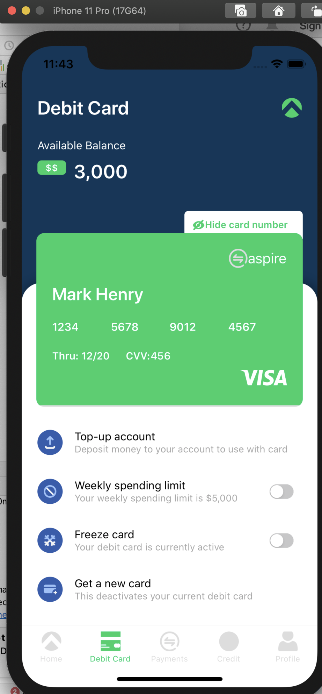
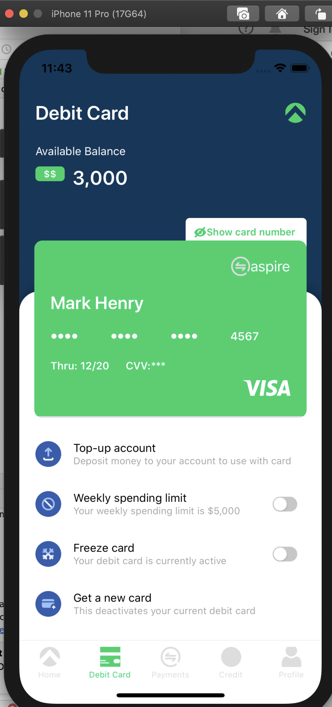
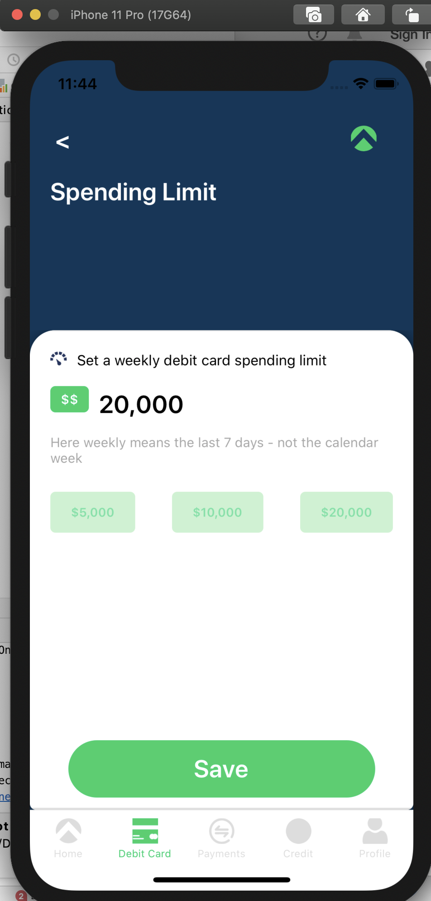
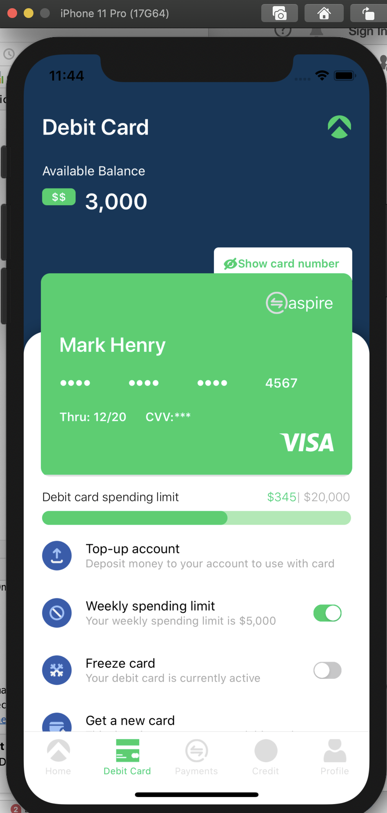

# Aspire Task.
- I have used axios with redux saga and miragjs for mock server api call
- Used styled/components for designing
- jest/enzyme for test cases

## Installation

Run `npm install` in the root directory to retrieve the node modules required to build and run this project.

## Commands

`npm start` kicks off the react-native JS packager.

`npm run ios` builds the ios project and kicks off the react-native JS packager.

`npm run android` builds the android project and kicks off the react-native JS packager.

## Screenshots

